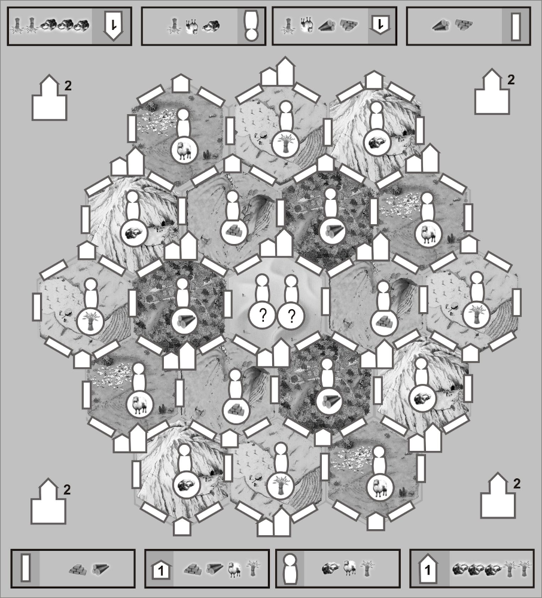
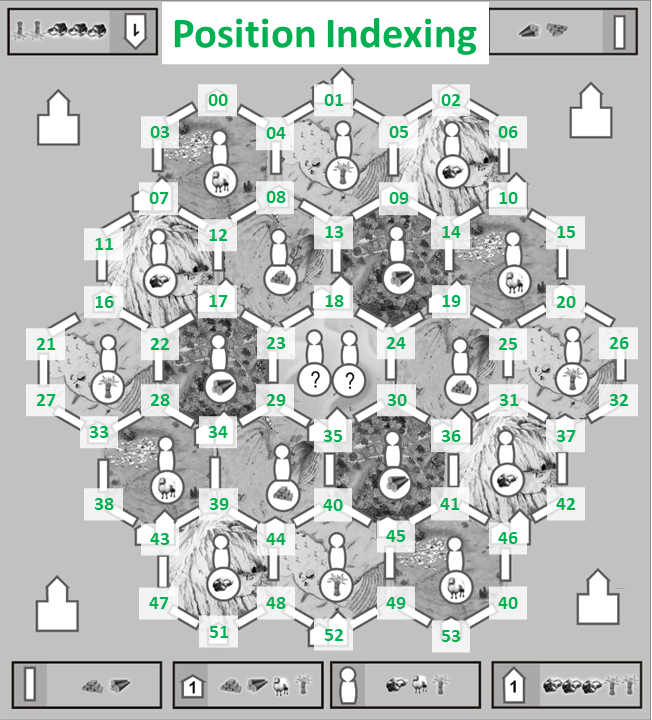
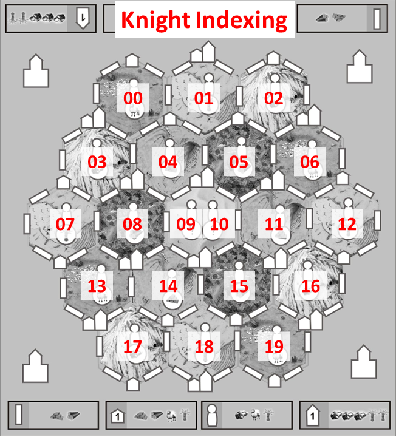

# COMP1110 Assignment 2

## Academic Honesty and Integrity

Honesty and integrity are of utmost importance. These goals are *not* at odds
with being resourceful and working collaboratively. You *should* be
resourceful, you should collaborate within your team, and you should discuss
the assignment and other aspects of the course with others taking the class.
However, *you must never misrepresent the work of others as your own*. If you
have taken ideas from elsewhere or used code sourced from elsewhere, you must
say so with *utmost clarity*. At each stage of the assignment you will be asked
to submit a statement of originality, either as a group or as individuals. This
statement is the place for you to declare which ideas or code contained in your
submission were sourced from elsewhere.

Please read the ANU's [official position](http://academichonesty.anu.edu.au/)
on academic honesty. If you have any questions, please ask me.

Carefully review the statements of originality in the [admin](admin) folder
which you must complete at each stage.  Edit the relevant statement and update
it as you complete each stage of the assignment, ensuring that when you
complete each stage, a truthful statement is committed and pushed to your repo.

## Purpose

In this assignment you will *work as a group* to master a number of major
themes of this course, including software design and implementation, group
work, using development tools such as Git and IntelliJ, and using JavaFX to
build a user interface.  **Above all, this assignment will emphasize group
work**; while you will receive an individual mark for your work based on your
contributions to the assignment, **you can only succeed if all members
contribute to your group's success**.

## Assignment Deliverables

The assignment is worth 30% of your total assessment, and it will be
marked out of 30.  So each mark in the assignment corresponds to a
mark in your final assessment for the course.  Note that for some
stages of the assignment, you will get a _group_ mark, and for others
you will be _individually_ marked.  The mark breakdown and the due
dates are described on the
[deliverables](https://cs.anu.edu.au/courses/comp1110/assessments/deliverables/)
page.

Your tutor will mark your work via GitLab, so it is essential that you carefully follow instructions for setting up and maintaining your group repository.
You will be marked according to whatever is committed to your repository at the time of the deadline.
You will be assessed on how effectively you use Git as a development tool.

## Problem Description

Your task is to implement in Java, using JavaFX, a board game called the
[Catan Dice Game "Extra"](https://www.catan.com/sites/default/files/2021-07/catan-dice-game-extra.pdf). (The link lets you download the game rules booklet
as a PDF file.)

Catan Dice Game Extra is a spin-off (one of many) of the "Settlers of Catan"
game series. There are even several Catan dice games. If you search for
information or answers about the game on-line, make sure what you read
actually refers to the **Catan Dice Game "Extra"** (sometimes also known as
"XXL"), not one of the many other games in the series.

Assignment 2 for COMP1110 is built on the basic Catan Dice Game. You can
find (and may want to refer to) the rules for this game too on
[the Catan web site](https://www.catan.com/). However, the description here
is self-contained; you should not have any need to look at the COMP1110
assignment.

## Game Overview

Catan Dice Game Extra can be played by two or more players. Players take
turns rolling dice to obtain resources and using those resources to build
structures on a shared map.
All things built contribute to a player's score, and the player with the
highest score at the end of the game is the winner.
The network of structures built by each player must be connected, and each
structure can be built by only one player. Thus, there can be a race to
each valuable areas of the map, and to avoid being "cornered" by other players.

An overview of the game rules is given below. Use this, in addition to the
resources linked above. If anything is unclear, please consult Piazza for
clarification.

### The Game Board

The game board (or map) has five types of buildable structures: Roads
(rectangles, on the edges between the hexagonal tiles), Settlements
(the small house-like shapes at tile corners), Cities (the larger house
shapes, found next to a Settlement at some tile corners), Knights
(the figures near the centre of each tile), and the Castles (four larges
house-shapes at the corners, off the map).
As a player builds structures, they mark them off on their map by filling
them in; each player will have to use a different colour to identify the
things they have built.
Settlements are worth 1 point each, while Cities and Castels are worth 2
points each.

### Resources

There is six different types of resources: Ore, Grain, Wool (represented
by a sheep), Timber, Bricks and Gold. Each structure has a build cost, which
is the resources a player must have available to build it. For example,
building a Road consumes 1 Brick and 1 Timber. The build costs are summarised
at the top and bottom of the map. Gold is not used to build anything, but can
be traded for other resources (see "Trades and Swaps" below).

### Player Turn

There are some special rules for the first turn(s); these follow in the
section [Start of the Game](#start-of-the-game) below.

On their turn, a player first rolls the dice (there are six of them). Each
die is marked with the six different resources in the game.

After rolling, the player may select a number of dice to re-roll, and after
the first re-roll may again select a number of dice and roll a third time.

Next, the player can trade and/or swap resources (using Knights), and use
resources to build. A player can build more than one structure on the same
turn, as long as they have enough resources to build all of them. Building
actions are done in sequence, so that conditions required to build a
structure (see "Building Constraints" below) do not necessarily have to
be satisfied at the start of the turn. For example, a player may build a
Road to reach a Settlement, and then build that Settlement, on the same
turn. Also note that building and swapping can be interleaved: a Knight
can be used to swap a resource on the same turn that the knight was built
(but only after it has been built, of course).

When a player cannot take any more actions, or chooses not to, the turn
passes to the next player. Resources remaining at the end of the turn are lost 
(i.e., there is no accumulation of resources between turns).

### Building Constraints

In addition to having the resources available, there are certain constraints
on the order in which structures can be built:

*   Roads, Settlements and Cities must form a connected network, starting
    from the initial Road. To reach a Knight, a player must have built at
    least one Road that borders the Knight's hex, or one Settlement at one
    of the corners of the Knight's hex.

*   To build a City, a player must first have built the Settlement in the
    same location. (That is, a City is an "upgrade" of a Settlement.)

*   As explained in the game rules, you cannot "skip" a Settlement; that is,
    when determining which parts of the map a player can reach, you cannot
    trace a path through an unbuilt Settlement (to build a Road on the other
    side). However, if the Settlement is upgradeable to a City, you can
    continue building through the Settlement without upgrading it.

*   Structures built by other players block the path.

### Trades and Swaps

A player can change their resources in two ways: trading Gold for other
resources, at a rate of 2:1, or swapping resources using Knights.

To trade, the player simply exchanges two Gold for one resource of their
choice.

A Knight, once built, can be used once per game to swap a resource. Knights
on hexes marked with a resource allow the player to swap one available
resource of their choice for that resource. The two Knights in the dessert
hex at the centre of the board are wildcards: it can be used to swap one
available resource of the player's choice for one of any other resource
(including Gold).

### Longest Road and Largest Army

In addition to the points gained from building Settlements, Cities and
Castles, players can gain points for having the "longest road" and the
"largest army": these are worth 1 and 2 points, respectively.
The longest road points go to the player who currently has the longest
contiguous sequence of Roads built on the board - branches do not count -
once that sequence is at least 5 Roads long. The largest army points
go to the player who has the most Knights built on the board, as long as
they are at least 3. For the purpose of counting the size of the army,
it does not matter if the Knight's resource-swap function has been used
or not.

The title of having the longest road or largest army (and the associated
points) belongs to one player at a time, and can change hands during the
game, if another player builds a (strictly) longer road or larger army.
For example, the first player to build a Road sequence of length 5 gains
the longest road title; if another player also builds a sequence of length
5, the title stays with the player who did it first. But if another player
builds a sequence of 6 or more Roads, they then become the holder of the
longest road, and the associated 1 point is moved to them. This means
a player's score can decrease between turns (but only increase, or remain
unchanged, on their own turn).

### Start of the Game

At the start of the game, each player gets to build (i.e., mark) one of
the coastal Roads for free. This road will be the starting point of their
network. Players choose their starting Road in sequence, with the
constraint that the chosen Road must be **at least 5 steps aways from the
Roads chosen by all previous players**.

To compensate for the "first-mover advantage" of the player who picks their
starting Road first, this player only rolls only **three** dice for resources
on their first turn. Each subsequent player adds one more die, until the
number is six, and from that point on all players continue rolling six dice
on their turn. This means that in a four-player game, all players will be
rolling six dice from turn 2, but in a two-player game, it will take two
turns to ramp up to the full set of dice.

### Game End

The game ends as soon as one player reaches 10 victory points. This can
occur either through building a final Settlement, City or Castle, or
through capturing the longest road or largest army title by building a
Road or Knight.

## Encoding the Game State

The following text encoding is used by the `CatanDiceExtra` class to interface 
with the tests we provide for the various tasks.

You are strongly encouraged to use your own internal representation of the
game, and convert to and from the text encoding as required to fulfill the
tasks. The text representation is neither robust nor convenient to work
with, hence why you should use your own representation.

We encourage you to create your own tests. Your tests can interface
directly with your code. Do not edit the supplied tests, instead
add new files.

We will use different encodings to represent different aspects of the game:

- A _board state_ is a string that encodes the state of the map, current turn,
  and player scores. 
- An _action_ string specifies a player action (a re-roll, trade, swap, or 
  build); an array of action strings specifies a sequence of actions. This 
  encoding will be used to test the validity of the action sequences, and for
  you to output actions or plans for an AI-controlled player.

The encoding defined below, and the tests provided for the different tasks,
support only two players, named `W` and `X`. If you later implement an
extended version of the game with more players, you should rely on your
internal representation instead of the encoding.

## Board State

A board state string is of the format 
`[Turn][W Board State][X Board State][W Score][X Score]`. 
Each `[]` indicates one component, and the square brackets are not actually part
of the string - there is *no* delimiter. There are three types of components in
this string, namely:

- A _turn_ string specifying the status of the current turn. 
- A _player board state_ string specifying the structures owned by one player. 
- A _player score_ string specifying the scores of one player, including 
  longest road and largest army titles. 

### Turn
A turn string is of the format `[ID][# Dice][Rolls Done][Resources]`. This string
encodes information about the current turn.

- The `[ID]` section is a single character `W` or `X` denoting the current
  player. 
- The `[# Dice]` section is a single numerical character describing how many
  dices are being rolled this turn, it should be between 3 and 6 (inclusive). 
  The only exception being during the setup phase and players are building their
  first coast road, here this number should be 0. 
- The `[Rolls Done]` section describes how many times the dices have been
  rolled this turn. It should be a numerical value between 1 and 3. It is at 
  least 1 since there is 1 roll when the turn starts, and it is at most 3 since 
  there can be at most 3 rolls per turn. The setup phase is an exception where 
  this number should be 0. 
- The `[Resources]` section includes up to 6 ordered (alphabet ordering) 
  characters from below indicating what resources the player has available at 
  the moment. The number of characters may be different to the number of dices,
  since trades and builds may have occurred this turn. This section should be 
  empty during the setup phase.

  - `b`: **b**rick
  - `g`: **g**rain
  - `l`: **l**umber
  - `m`: gold (m for **m**oney)
  - `o`: **o**re
  - `w`: **w**ool

Note that `[Rolls Done]` being 3 does **not** necessarily indicate that 3 
rolls have actually occurred this turn. The encoding uses 3 to indicate that
the roll phase of the turn has ended (see encoding for actions).

A sample turn string is `X42bgoo`: the current player is player X, they are able
to roll four dices this turn and have rolled twice already (including the
initial roll). The current resources they have are 1 brick, 1 grain, and 2 ores.

### Player Board State

The player board state string is of the form `[ID][Placement]`. It encodes
information about a player's board, i.e. what they own. 

- The `[ID]` section is the same as in the turn string, a single character `W`
  or `X` denoting the player that the string is describing, it may be different
  to the current player.  
- The `[Placement]` section contains in alphanumerical order what structures
  (and knights) are owned by the player. The game contains the following
  structures:
  - The four **c**astles (`C`) are referenced in clockwise order by top-right
    (`0`), bottom-right (`1`), bottom-left (`2`) and top left (`3`).
  - It is important used and unused knights be labelled differently. Both unused
    knights (`J`) and used knights (`K`) are referenced according to the knight 
    indexing figure below. A used knight at position `04`
    will be `K04` and if it was unused it would be `J04`.
  - **R**oads (`R`) are referenced by the two positions they connect, as per the
    position indexing figure below. A road from position `18` to position `23` 
    will be `R1823`, but it *cannot* be called `R2318` as we require the lower 
    numbered position to come first.
  - **S**ettlements (`S`) and ci**t**ies (`T`) are referenced by their 
    positions. A settlement at position `00` will be `S00` and a city at 
    position `10` will be `T10`. Note that not every position has a settlement 
    or city.

|                 Position Indexing                  |                Knight Indexing                 |
|:--------------------------------------------------:|:----------------------------------------------:|
|  |  |

A sample player board state string is `WC0C3J03K02K05R0004R0104R0408S00T01`,
indicating that player `W` 

- has castles `0` and `3`, 
- owns knights `02`, `03`, and `05` but has used `02` and `05`, 
- has three roads (`00`<->`04`, `01`<->`04`, and `04`<->`08`)
- has a settlement at position `00`
- has a city at position `01`

### Player Score

The last component of the board state string is the player score string. This
describes how a player is going, and is of the form `[ID][Score][R/A optional]`.

- `[ID]`, as above, is the ID of the player that this string is referring to. 
- `[Score]` is two digits describing the score of the player
- `[R/A optional]` describes the special titles: `R` for longest **r**oad) and
  `A` for largest **a**rmy. 

For example, `W08R` means player `W` has 8 points and holds the longest road
title, while `X10RA` means player `X` has 10 points (they've won!) and has the
both the longest road and largest army titles. Note that when a player holds
both titles, we require `R` to come before `A`. 

## Action

We consider each turn in two phases. First is the roll phase, where the
current player is deciding what dice to keep and re-rolling the others. After
that is the build phase, where the player can build, trade, and swap using
the resources they have. Which phase the game is in is determined by the turn
component of the board state string. In particular, if the number of rolls done
is the number 3, then the game is the build phase, otherwise it is in the
rolling phase. If you are not sure why the number 3, check the description for 
the turn string. Because the phase can already be determined from the board
state, there is no need to indicate it when encoding actions. 

The only exception is the setup phase, where players are building their first
coastal road. Here the roll phase is skipped and only the build action in the
build phase is allowed, for building coastal roads at least distance 5 away from
other players' roads. 

### Roll Phase

Here there is only one action possible - re-roll. To encode this action we use
a string describing all the resources the player wishes to keep, and all other
resources will be re-rolled. 
- `keep[Resources]` for keeping resources. The resources should be encoded in the same manner
as in the turn string, and prefixed by `keep`. If the 
player wishes to keep all resources, the game moves on to the build phase. 

As an example, if the player currently has rolled resources `bmmoww`, and does
not want the wools, then the re-roll action would be encoded as `keepbmmo`. If
instead they like all their resources, the re-roll action would be encoded as
`keepbmmoww` and the game would move on to the build phase. 

### Build Phase

There are three possible actions in this phase, so an action in this phase is of
one of three possible forms,

- `build[Structure Identifier]` for building a structure (or knight), the
  structure identifier is of the same form as a single structure in the player
  board state string. As an example `buildR0004` is for building a road from
  position `00` to position `04`. Only `K` is allowed for building knight, 
  which means `buildJ02` is invalid action.
- `trade[Resources]` for trading the given resources using two gold for each
  resource. The resources are specified the same way as in the turn string.
  For example, `tradebw` means using 4 gold to trade 1 brick and 1 wool. Note
  players cannot use gold to trade for gold. 
- `swap[Resource Out][Resource In]` for swapping `Resource In` to 
  `Resource Out`. Note that both `[Resource In]` and `[Resource Out]` are just a
  single resource. For example `swapgb` means exchange 1 grain for 1 brick. In
  this case, the lowest indexed **brick-only** knight owned by the current
  player is used. If there is no brick-only knight, then the lowest-indexed
  "multi-purpose" knight owned by the current player is used. 

## Evaluation Criteria

It is essential that you refer to the
[deliverables page](https://cs.anu.edu.au/courses/comp1110/assessments/deliverables/)
to check that you understand each of the deadlines and what is
required.  Your assignment will be marked via tests run through git's
continuous integration (CI) framework, so all submittable materials
will need to be in git and in the *correct* locations, as prescribed
by the
[deliverables page](https://cs.anu.edu.au/courses/comp1110/assessments/deliverables/).

**The mark breakdown is described on the
[deliverables](https://cs.anu.edu.au/courses/comp1110/assessments/deliverables/)
page.**

### Part One

In the first part of the assignment you will:
* Set up your assignment (Task #1).
* Create a design skeleton (Task #2).
* Implement parts of the text interface to the game (Tasks #3 and #4).
* Implement basic dice rolling (Task #5).
* Implement a simple viewer that allows you to visualize game states (Task #6).
* Implement basic checks for action validity (Task #7).
* Create functions to assist calculating the longest road and largest army (Task #8).

An indicative grade level for each task for the [completion of part one](https://cs.anu.edu.au/courses/comp1110/assessments/deliverables/#D2C) is as follows:

**Pass**
* Tasks #1, #2, #3 and #4.

**Credit**
* Task #5 and #6 *(in addition to all tasks required for Pass)*

**Distinction**
* Task #7 and #8 *(in addition to all tasks required for Credit)*

### Part Two

Create a fully working game, using JavaFX to implement a playable
graphical version of the game in a 1200x700 window.

Notice that aside from the window size, the details of exactly how the
game looks etc, are **intentionally** left up to you. You may choose to
closely follow the look of the original board game, or you may choose to
present the game in totally different manner.

The only **firm** requirements are that:

* You must use Java 17 and JavaFX 17.
* Your implementation must respect the specification of the game rules
  given here.
* Your game must be easy to play.
* Your game must runs in a 1200x700 window.
* Your game must be executable on a standard lab machine from a jar
  file called `game.jar`,

Your game must successfully run from `game.jar` from within another
user's (i.e.  your tutor's) account on a standard lab machine. In
other words, your game must not depend on any features not self-contained
within that jar file and the Java 17 runtime.

An indicative grade level for each task for the [completion of part
two](https://cs.anu.edu.au/courses/comp1110/assessments/deliverables/#D2F)
is as follows:

**Pass**
* Correctly implements all of the <b>Part One</b> criteria.
* Appropriate use of git (as demonstrated by the history of your repo).
* Completion of Task #11.
* Executable on a standard lab computer from a runnable jar file,
  game.jar, which resides in the root level of your group repo.

**Credit**
* _All of the Pass-level criteria, plus the following..._
* Tasks #9 and #10.

**Distinction**
* _All of the Credit-level criteria, plus the following..._
* Tasks #12 and #13.

**High Distinction**
* _All of the Distinction-level criteria, plus the following..._
* Tasks #14, #15 and #16.
